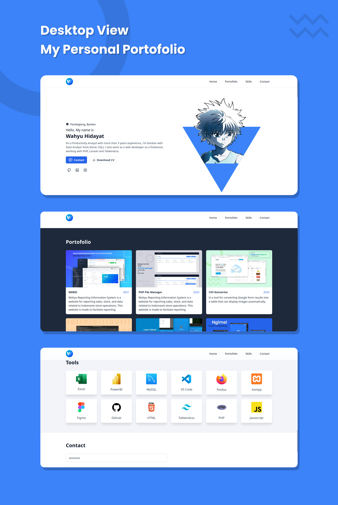
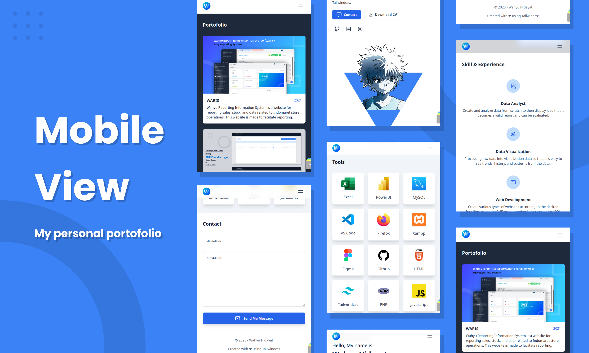

# My Personal Portofolio

This is a my personal portofolio for branding myself, i have created this portofolio for 5 days. Feel free to use this portofolio template, just edit some text, colors, and other elements. This portofolio build with Tailwindcss and small of javascript code.

### Demo :

https://wahyuhidayattz.github.io/

### Installation on your local :

1. Clone or Download this repo :
    
    ```
    git clone https://github.com/WahyuHidayattz/wahyuhidayattz.github.io.git
    ```

2. Open folder project with VS Code or other text editor

3. Install Tailwindcss modules using terminal

    ```
    npm i
    npx tailwindcss -i ./src/input.css -o ./assets/app.css --watch
    ```

4. Configure text, portofolio list, skills list in config.js

    ```
    // portofolio lists
    let portofolio = [{},{},{},...],

    // skills list
    let skills = [{},{},{},...],

    // Tools list
    let tools = [{},{},{},...], 
    ```

### Screenshots :

1. Desktop View
    

2. Mobile View
    